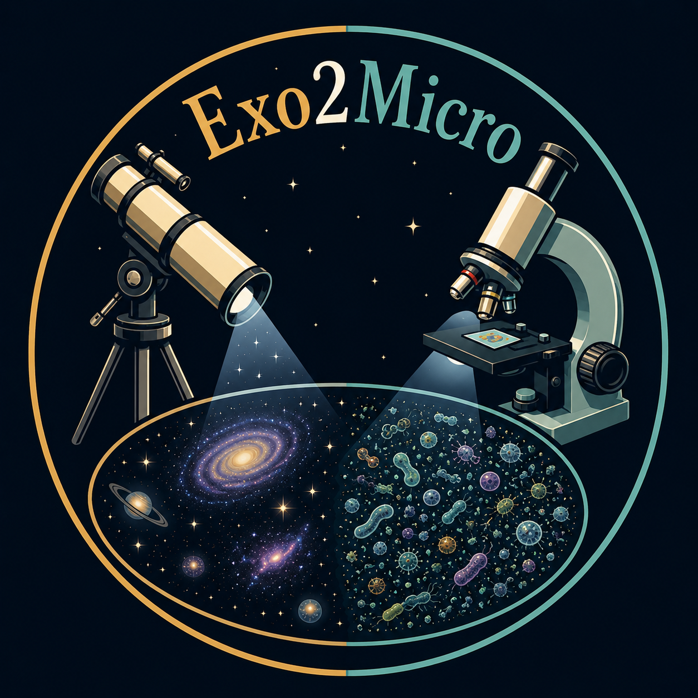

# Exoplanets to Microbes (Exo2Micro) Pipeline

<p align="center">
  
</p>

**exo2micro** is an image registration and fluorescence subtraction
pipeline for pre/post-stain microscopy. It has been designed to process paired pre-stain and post-stain microscopy images by (a) aligning the images using an iterative process that allows for translation, rotation, shear, and magnification differences between pre- and post- stain images, (b) estimating the autofluorescent mineral background signal, and (c) optimally subtracting pre- from post-stain images to reveal microbe-only signal. The software is still in active development.

This software was developed as a collaboration between the [Follette Lab at Amherst College](https://www.follettelab.com), which specializes in astronomical image processing, especially of extrasolar planets, and the [Marlow Lab at Boston University](https://www.marlowscience.com/), which specializes in microscopy imaging of astrobiologically interesting terrestrial rock samples. Development of this software was supported by Heising-Simons Foundation grant #2022-3992 issued as part of the [Scialog: Signatures of Life in the Universe](https://rescorp.org/scialog/signatures-of-life-in-the-universe/) conference series. The software is named for the title of our original grant proposal: "Exoplanets to Microbes: Using Astronomical Image Processing Techniques to Detect Microbes in Astrobiological Contexts".

The current software was written and is maintained by Kate Follette. Undergraduate researchers Giselle Hoermann, Kinsey Cronin, Jessica Laboissiere, Sarah Vierling, and Suyash Deshmukh contributed significantly to early versions of some of its functionalities.

---

## Documentation

Full documentation is available at [exo2micro.readthedocs.io](https://exo2micro.readthedocs.io).
This README covers installation and a minimal quickstart; the docs cover the GUI, scripting API, scale method guidance, troubleshooting, and developer reference.

---

## Before You Start

If you've never installed a Python package from GitHub before, the
[Before You Start](https://exo2micro.readthedocs.io/en/latest/users/before_you_start.html)
page walks you through everything you need on your computer first — opening
a terminal on macOS or Windows, making a GitHub account, installing Python
(via Miniforge), and getting JupyterLab running. **Start there if any of
the following are true:**

- You don't have a Python installation on your computer.
- You don't have a GitHub account.
- You've never opened a terminal (Terminal on Mac, Windows Terminal on PC).
- You don't have JupyterLab or Jupyter Notebook installed.

If all four are already set up, skip ahead to [Installation](#installation)
below.

---

## Installation

```bash
# Clone the repository
git clone https://github.com/kfollette/Exo2Micro.git
cd Exo2Micro

# Install dependencies
pip install numpy scipy opencv-python-headless matplotlib astropy tifffile Pillow ipywidgets
```

See the [installation page](https://exo2micro.readthedocs.io/en/latest/users/installation.html) for the full dependency list and troubleshooting.

---

## Quick Start

The recommended way to use exo2micro is through the interactive Jupyter GUI.

In a terminal, navigate to where you cloned exo2micro and launch JupyterLab:

```bash
cd Exo2Micro
jupyter lab
```

Your web browser will open with the JupyterLab interface. In the file browser on the left, double-click `exo2micro_notebook.ipynb` to open it, then run both setup cells (click in each cell and press Shift+Enter). The exo2micro GUI should appear under the second cell.

If you see something like `VBox(children=(HTML(value=...)))` instead of an actual GUI, ipywidgets isn't installed correctly — run `pip install ipywidgets` in your terminal, then restart the JupyterLab kernel (Kernel menu → Restart Kernel) and re-run the cells.

To stop JupyterLab when you're done, return to the terminal window and press `Ctrl+C`.

**Raw image directory layout.** Your raw images should live in a directory tree with one folder per sample, with filenames following the conventions described in the [filename rules section of the installation guide](https://exo2micro.readthedocs.io/en/latest/users/installation.html#filename-rules).

**Scripting and batch processing.** A Python API and batch-processing interface are also available. See the [scripting API](https://exo2micro.readthedocs.io/en/latest/developers/scripting_api.html) for details.

---

## How It Works

The pipeline has four stages: padding, boundary alignment (coarse + ICP), interior alignment (SIFT feature matching), and diagnostics & subtraction. Each stage saves checkpoints, so you can stop and resume at any point. See the [Conceptual Overview](https://exo2micro.readthedocs.io/en/latest/developers/concepts.html) for details on each stage, and [Scale Methods](https://exo2micro.readthedocs.io/en/latest/users/scale_methods.html) for the available scale-estimation methods.

---

## Citation

A paper describing exo2micro is in preparation. If you use this software in work you plan to publish, please contact Kate Follette (kfollette@amherst.edu) so we can coordinate citation.

---

## License

exo2micro is released under the MIT License. See the [LICENSE](LICENSE) file for the full text.

In brief: you're free to use, modify, and redistribute this software for any purpose, including commercial use, as long as you retain the copyright notice. The software comes with no warranty.
